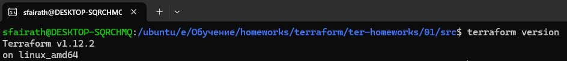

# Домашнее задание к занятию «Введение в Terraform»

### Цели задания

1. Установить и настроить Terrafrom.
2. Научиться использовать готовый код.

------

### Чек-лист готовности к домашнему заданию

1. Скачайте и установите **Terraform** версии >=1.12.0 . Приложите скриншот вывода команды ```terraform --version```.
2. Скачайте на свой ПК этот git-репозиторий. Исходный код для выполнения задания расположен в директории **01/src**.
3. Убедитесь, что в вашей ОС установлен docker.



------

### Инструменты и дополнительные материалы, которые пригодятся для выполнения задания

1. Репозиторий с ссылкой на зеркало для установки и настройки Terraform: [ссылка](https://github.com/netology-code/devops-materials).
2. Установка docker: [ссылка](https://docs.docker.com/engine/install/ubuntu/). 
------
### Внимание!! Обязательно предоставляем на проверку получившийся код в виде ссылки на ваш github-репозиторий!
------

### Задание 1

1. Перейдите в каталог [**src**](https://github.com/netology-code/ter-homeworks/tree/main/01/src). Скачайте все необходимые зависимости, использованные в проекте. 
2. Изучите файл **.gitignore**. В каком terraform-файле, согласно этому .gitignore, допустимо сохранить личную, секретную информацию?(логины,пароли,ключи,токены итд)

### Ответ
```
# own secret vars store.
personal.auto.tfvars
```
3. Выполните код проекта. Найдите  в state-файле секретное содержимое созданного ресурса **random_password**, пришлите в качестве ответа конкретный ключ и его значение.

### Ответ
```
"result": "Ilya7fkSltb4PDOV",
```
Или
```
random_password.random_string.result
```
4. Раскомментируйте блок кода, примерно расположенный на строчках 29–42 файла **main.tf**.
Выполните команду ```terraform validate```. Объясните, в чём заключаются намеренно допущенные ошибки. Исправьте их.
Ошибка 1 заключается в том, что для ресурса ```docker_image``` не указано имя
Ошибка 2 заключается в том, что у ресурса ```"docker_container" "1nginx"``` неправильно указано имя. Оно может начинатся с буквы или _, и содержать буквы, цифры, подчёркивания и тире.
Ошибка 3 заключается в том, что ресурс ```"random_password" "random_string_FAKE"``` не объявлен. И опечатка в параметре ```.resulT```. Чувствительно к регистру.
5. Выполните код. В качестве ответа приложите: исправленный фрагмент кода и вывод команды ```docker ps```.

### Ответ
```
resource "docker_image" "nginx" {
  name         = "nginx:latest"
  keep_locally = true
}

resource "docker_container" "nginx_container" {
  image = docker_image.nginx.image_id
  name  = "example_${random_password.random_string.result}"

  ports {
    internal = 80
    external = 9090
  }
}

sfairath@DESKTOP-SQRCHMQ:/ubuntu/e/Обучение/homeworks/terraform/ter-homeworks/01/src$ docker ps
CONTAINER ID   IMAGE          COMMAND                  CREATED         STATUS         PORTS                  NAMES
61c48cb6e12c   05b8cb60c354   "/docker-entrypoint.…"   2 minutes ago   Up 2 minutes   0.0.0.0:9090->80/tcp   example_Ilya7fkSltb4PDOV
```
6. Замените имя docker-контейнера в блоке кода на ```hello_world```. Не перепутайте имя контейнера и имя образа. Мы всё ещё продолжаем использовать name = "nginx:latest". Выполните команду ```terraform apply -auto-approve```.
Объясните своими словами, в чём может быть опасность применения ключа  ```-auto-approve```. Догадайтесь или нагуглите зачем может пригодиться данный ключ? В качестве ответа дополнительно приложите вывод команды ```docker ps```.

### Ответ
Опасность ключа ```-auto-approve`` в том, что команда ``terraform apply``` или ```terraform destroy``` не запрашивает подтверждения пользователя на выполнение.

```
CONTAINER ID   IMAGE          COMMAND                  CREATED         STATUS         PORTS                  NAMES
540ca8b93871   05b8cb60c354   "/docker-entrypoint.…"   4 seconds ago   Up 4 seconds   0.0.0.0:9090->80/tcp   hello_world
```
7. Уничтожьте созданные ресурсы с помощью **terraform**. Убедитесь, что все ресурсы удалены. Приложите содержимое файла **terraform.tfstate**. 

### Ответ
```tfstate
{
  "version": 4,
  "terraform_version": "1.12.2",
  "serial": 11,
  "lineage": "1933e0fd-c7d8-3912-06a4-c01ec12dc0d5",
  "outputs": {},
  "resources": [],
  "check_results": null
}
```

8. Объясните, почему при этом не был удалён docker-образ **nginx:latest**. Ответ **ОБЯЗАТЕЛЬНО НАЙДИТЕ В ПРЕДОСТАВЛЕННОМ КОДЕ**, а затем **ОБЯЗАТЕЛЬНО ПОДКРЕПИТЕ** строчкой из документации [**terraform провайдера docker**](https://library.tf/providers/kreuzwerker/docker/latest).  (ищите в классификаторе resource docker_image )

### Ответ
Образ не удаляется из-за параметра ```keep_locally = true``` в docker_image

```
keep_locally (Boolean) If true, then the Docker image won't be deleted on destroy operation. If this is false, it will delete the image from the docker local storage on destroy operation.
```

------